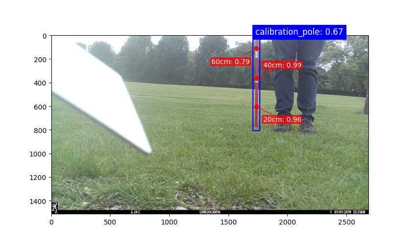

# Cali

Cali is a deep learning model for detecting and annotating calibration poles in camera trap imagery.




## Installation

```bash
pip install git+https://github.com/bencevans/cali.git
```

## CLI

### `detect`

Run detection on a single image or a directory of images and save the results to a JSON file.

```
cali detect [--conf-threshold FLOAT] [--recursive] [--relative] <image_source> <output>
```

| Argument | Description |
|---|---|
| `image_source` | Path to an image file or a directory of images |
| `output` | Path to write the JSON results file |
| `--conf-threshold` | Confidence threshold for detections (default: `0.5`) |
| `--recursive` | Recurse into subdirectories when `image_source` is a directory |
| `--relative` | Store image paths relative to `image_source` in the JSON output |

**Examples**

```bash
# Single image
cali detect image.jpg results.json

# Directory of images, save paths relative to the source directory
cali detect /path/to/images/ results.json --recursive --relative
```

### `plot`

Display detections and keypoints overlaid on an image using matplotlib.

```
cali plot [--conf-threshold FLOAT] <image_source>
```

```bash
cali plot image.jpg
```

## Programmatic use

### Single image

```python
from cali import Cali, plot_result

model = Cali()

result = model.detect("/path/to/image.jpg")
# result is an ImageResult with .image_path, .width, .height, .detections

for detection in result.detections:
    print(detection.name, detection.confidence, detection.bounding_box)
    for kp in detection.keypoints:
        print(kp)

plot_result(result)
```

### Multiple images (streaming)

`detect_generator_list` yields one `ImageResult` per image as inference completes, without waiting for the full list to finish:

```python
from cali import Cali

model = Cali(conf_threshold=0.6)

image_paths = ["/path/to/a.jpg", "/path/to/b.jpg"]

for result in model.detect_generator_list(image_paths):
    print(f"{result.image_path}: {len(result.detections)} detection(s)")
```

To collect all results at once use `detect_list`:

```python
results = model.detect_list(image_paths)
```

## Data models

```
ImageResult
├── image_path: str
├── width: int
├── height: int
└── detections: list[Detection]
       ├── name: "calibration_pole"
       ├── confidence: float
       ├── bounding_box: (x1, y1, x2, y2)
       └── keypoints: list[ExtentKeypoint | HeightKeypoint]

ExtentKeypoint   – base or top of the pole
├── name: "base" | "top"
├── x, y: float
└── confidence: float

HeightKeypoint   – a marked height along the pole (20 cm, 40 cm, …)
├── name: "height"
├── x, y: float
├── height: float  (metres from base)
└── confidence: float
```
